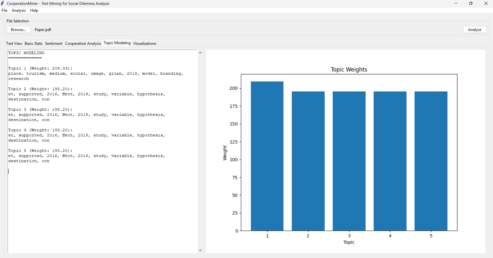
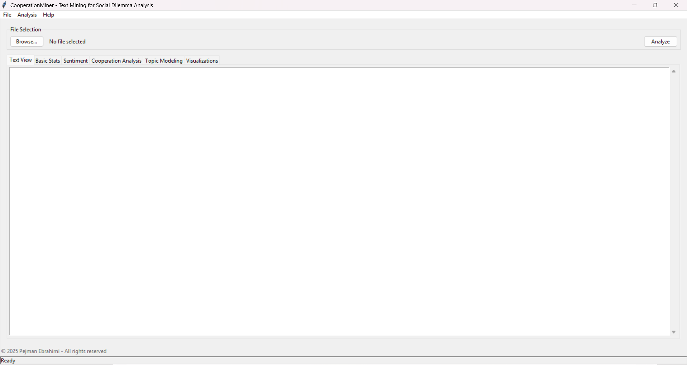

# CooperationMiner

**Text Mining for Social Dilemma Analysis**

Developed by Pejman Ebrahimi (pejman.ebrahimi@uni.li)

[](https://www.linkedin.com/in/pejman-ebrahimi-4a60151a7/)
[](https://huggingface.co/arad1367)
[](https://arad1367.github.io/pejman-ebrahimi/)
[](https://www.uni.li/pejman.ebrahimi?set_language=en)

## Table of Contents
- [Overview](#overview)
- [Features](#features)
- [Installation](#installation)
- [Usage](#usage)
- [Analysis Capabilities](#analysis-capabilities)
- [Screenshots](#screenshots)
- [Troubleshooting](#troubleshooting)
- [License](#license)

## Overview

CooperationMiner is a specialized text mining application designed to analyze communication patterns in social dilemma situations. The tool identifies cooperative language, sentiment patterns, and topics to provide insights into how communication facilitates cooperation in social dilemmas.

## Features

- **Multi-format Support**: Analyze text from TXT, PDF, DOCX, and CSV files
- **Comprehensive Text Analysis**: Basic statistics, sentiment analysis, cooperation metrics
- **Topic Modeling**: Discover underlying themes in communication
- **Entity Recognition**: Identify named entities in the text
- **Data Visualization**: Generate word clouds, cooperation trends, emotion distributions
- **Result Export**: Save analysis results for further research

## Installation

### Prerequisites
- Python 3.8+
- Required Python packages:

```
tkinter
pandas
numpy
matplotlib
seaborn
nltk
docx
PyPDF2
spacy
scikit-learn
textblob
gensim
wordcloud
```

### Setup Instructions

1. Clone the repository:
   ```bash
   git clone https://github.com/PejmanEbrahimi/CooperationMiner.git
   cd CooperationMiner
   ```

2. Create and activate a virtual environment:
   ```bash
   python -m venv texmini-env
   # On Windows
   texmini-env\Scripts\activate
   # On Linux/Mac
   source texmini-env/bin/activate
   ```

3. Install the required packages:
   ```bash
   pip install -r requirements.txt
   ```

4. Download required NLTK data:
   ```python
   import nltk
   nltk.download('punkt')
   nltk.download('stopwords')
   nltk.download('wordnet')
   nltk.download('vader_lexicon')
   ```

5. Download required spaCy model:
   ```bash
   python -m spacy download en_core_web_sm
   ```

## Usage

Run the application:
```bash
python app.py
```

Basic workflow:
1. Click "Browse..." to select a text file for analysis
2. View the loaded text in the "Text View" tab
3. Click "Analyze" to run the full analysis
4. Navigate through the tabs to explore different aspects of the analysis
5. Use the "Visualizations" tab to generate different visual representations
6. Save your results using "File" → "Save Results"

## Analysis Capabilities

### Basic Text Statistics
- Word count, sentence count, character count
- Average word and sentence length
- Unique word count
- Most frequent words

### Sentiment Analysis
- Overall sentiment polarity (positive/negative/neutral)
- Sentence-level sentiment scores
- Most positive and negative sentences

### Cooperation Analysis
- Detection of cooperative and non-cooperative language
- Cooperation tendency score
- Cooperative vs. non-cooperative keyword frequency
- Most and least cooperative sentences

### Topic Modeling
- Identification of main topics in the text
- Key words for each topic
- Topic weight distribution

### Entity Recognition
- Identification of named entities (people, organizations, locations, etc.)

### Visualizations
- Word clouds
- Cooperation tendency over time
- Emotion distribution
- Topic distribution

## Screenshots

### Main Interface


### Topic Modeling Analysis


### Data Visualization


## Troubleshooting

### Common Issues

**NLTK Resource Error**
If you encounter errors related to missing NLTK resources:
```
Resource punkt_tab not found.
```

Solution:
```python
# Add this to your main() function in app.py
import os
import nltk

# Create a local nltk_data directory if it doesn't exist
if not os.path.exists('nltk_data'):
    os.makedirs('nltk_data')

# Download all required NLTK data to the local directory
nltk.download('punkt', download_dir='nltk_data')
nltk.download('stopwords', download_dir='nltk_data')
nltk.download('wordnet', download_dir='nltk_data')
nltk.download('vader_lexicon', download_dir='nltk_data')

# Add the local path to NLTK's search paths
nltk.data.path.insert(0, './nltk_data')
```

**Custom Sentence Tokenization**
If NLTK's sentence tokenizer continues to cause issues, replace the preprocess_text method:
```python
def preprocess_text(self, text):
    stop_words = set(stopwords.words('english'))
    lemmatizer = WordNetLemmatizer()
    
    # Custom sentence tokenization using regex
    import re
    sentence_endings = r'(?<=[.!?])\s+(?=[A-Z])|(?<=[.!?])\s*\n'
    self.sentences = re.split(sentence_endings, text)
    
    tokens = []
    for sentence in self.sentences:
        words = word_tokenize(sentence.lower())
        words = [word for word in words if word.isalnum()]
        words = [word for word in words if word not in stop_words]
        words = [lemmatizer.lemmatize(word) for word in words]
        tokens.extend(words)
    
    self.tokens = tokens
    self.processed_text = " ".join(tokens)
    return self.processed_text
```

## License

© 2025 Pejman Ebrahimi - All rights reserved

This software is provided for academic and research purposes only. No part of this software may be reproduced, distributed, or transmitted in any form or by any means, without the prior written permission of the author.
